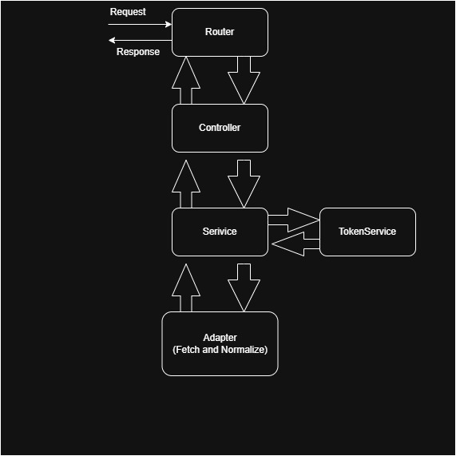

# 🧩 SyncTrade – Broker Integration Layer (One-Way Sync)
This project implements a modular backend architecture that synchronizes trades from third-party brokers (e.g., Zerodha, Alpaca). It focuses on **clean design**, **scalability**, and **token-based authentication** handling for each broker’s API.
---
## 🚀 Overview
SyncTrade integrates multiple brokers under a **unified interface**.
Each broker may have different APIs, authentication models, and data structures — this backend abstracts those differences via **Adapters**, **Normalizers**, and **Services**.

Core features include:
* Modular **Broker Adapter System**
* **Trade Data Normalization**
* **Token Management with Expiry and Refresh**
* Extensible architecture to easily plug in new brokers
* Simulated and real API calls with fallback to mock data

---

## 🏟️ Project Structure

```
src/
│
├── adapters/
│   ├── zerodhaKite.adapter.ts
│   ├── alpaca.adapter.ts
│   ├── genericBroker.adapter.ts
│   └── index.ts
│
├── controllers/
│
├── services/
│   ├── broker.service.ts
│   ├── zerodha.service.ts
│   └── token.service.ts
│
├── normalizers/
│   ├── zerodhaKite.normalizer.ts
│   └── alpaca.normalizer.ts
│
├── utils/
│   ├── config.ts
│   ├── constants.ts
│   ├── customError.ts
│   └── result.ts
│
├── types/
│
├── routers/
│
└── index.ts
```

---
## 🧱 System Architecture



---

## 🧱 Architecture Design

### 1️⃣ Adapters (Integration Layer)

Each broker adapter handles:

* Authenticating API calls
* Fetching raw trade/order data
* Returning raw broker data (not yet normalized)

Example:

```ts
async fetchTrades(accessToken: string) {
  const response = await axios.get("https://api.kite.trade/trades", {
    headers: { Authorization: `token ${apiKey}:${accessToken}` },
  });
  return response.data.data;
}
```

#### Common Adapter Registry

```ts
import zerodhaKiteAdapter from './zerodhaKite.adapter.js';
import alpacaAdapter from './alpaca.adapter.js';

export const adapters = {
  zerodha: zerodhaKiteAdapter,
  alpaca: alpacaAdapter,
};
```

To add a new broker:

1. Create a new adapter file
2. Implement `fetchTrades()`
3. Register it in `adapters/index.ts`

---

### 2️⃣ Normalizers (Data Formatting Layer)

Different brokers return data in unique shapes.
Normalizers standardize data into a unified `Trade` model.

---

### 3️⃣ Services (Business Logic Layer)

#### BrokerService

* Selects the correct adapter
* Fetches tokens via `TokenService`
* Fetches & normalizes trades
* Returns unified data

#### ZerodhaService

Handles the Zerodha OAuth flow:

1. User logs in via `https://kite.zerodha.com/connect/login?v=3&api_key=<your_api_key>`
2. Zerodha redirects to callback URL `https://115a17c01e08.ngrok-free.app/api/v1/broker/zerodha/callback`
3. The backend exchanges the `request_token` for `access_token` & `refresh_token`
4. Tokens are stored in-memory for the user
---

## 🔁 Zerodha Flow

1️⃣ **User Login**

```
https://kite.zerodha.com/connect/login?v=3&api_key=kgd383q566bqi1o6
```

2️⃣ **OAuth Callback**

```
https://115a17c01e08.ngrok-free.app/api/v1/broker/zerodha/callback?request_token=xyz
```

3️⃣ **Backend Flow**

* Exchanges `request_token` for access & refresh token
* Saves in memory (`TokenService`)
* Fetches trades from Zerodha API

During testing when i was placing the order, Zerodha returned:

```json
{
  "status": "error",
  "message": "Markets are closed right now."
}
```

Because the market were closed 
Hence, used mock data (of identical structure) was used for normalization.

---

## 🔁 Alpaca Flow

* Alpaca uses static API keys (no OAuth)
* Orders fetched using:

```
GET https://paper-api.alpaca.markets/v2/orders
```

* Normalized into unified Trade format
* Example mock order stored in `mocks/` for development

---

## 🧩 Adding a New Broker

To add a new broker:

1. Create a new adapter: `src/adapters/<broker>.adapter.ts`
2. Implement `fetchTrades(accessToken)` logic.
3. Add to `adapters/index.ts`:

```ts
import myBrokerAdapter from './myBroker.adapter.js';
export const adapters = { ...adapters, mybroker: myBrokerAdapter };
```

4. Optionally add a normalizer in `/normalizers`.
5. If it uses tokens, define handling in `TokenService`.

---

## 🔐 Assumptions

* `userId` is simulated for now — in a real system, this would be extracted from user sessions/JWTs.
* Some brokers (like Alpaca) don’t return `access_token`; static API keys are used instead.
* Tokens are stored in memory for simulation purposes.
* Mock data used for Zerodha during closed market hours.

---

## 🧩 API Endpoints

| Method | Endpoint                          | Description                                        |
| ------ | --------------------------------- | -------------------------------------------------- |
| `GET`  | `/api/v1/broker/zerodha/callback` | Receives `request_token` and stores Zerodha tokens |
| `POST` | `/api/v1/broker/sync/zerodha`     | Syncs Zerodha trades                               |
| `POST` | `/api/v1/broker/sync/alpaca`      | Syncs Alpaca trades                                |

---

## 🧩 Design Decisions

* **Adapter pattern:** isolates broker-specific logic and ensures scalability.
* **Service layer:** separates orchestration logic from raw data access.
* **Normalizer layer:** creates uniform structure for heterogeneous broker data.
* **Token service:** realistic simulation of per-user auth, expiry, and refresh.
* **Mock data fallback:** allows testing even if APIs are unavailable or markets are closed.
* **Clean separation of concerns:** ensures maintainability and extensibility.

---

## ✅ Summary

| Layer            | Responsibility                               |
| ---------------- | -------------------------------------------- |
| **Adapters**     | Handle broker API communication              |
| **Normalizers**  | Standardize trade/order data                 |
| **Services**     | Orchestrate fetch, normalize, and token flow |
| **Controllers**  | Handle errors if any thrown in service       |
| **Routers**      | Handle routes requests                       |
| **TokenService** | Manage access/refresh tokens                 |
| **Utils**        | Shared config, constants, error helpers      |

### 🧩 Author

**Samuel Masih**
Full Stack Developer | React • Next.js • Node.js • Express.js • TypeScript • PostgreSQL • Firestore • ElasticSearch
